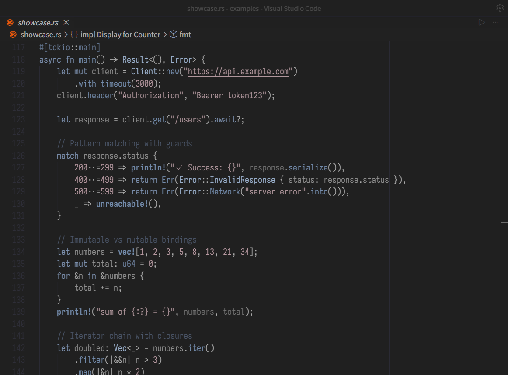
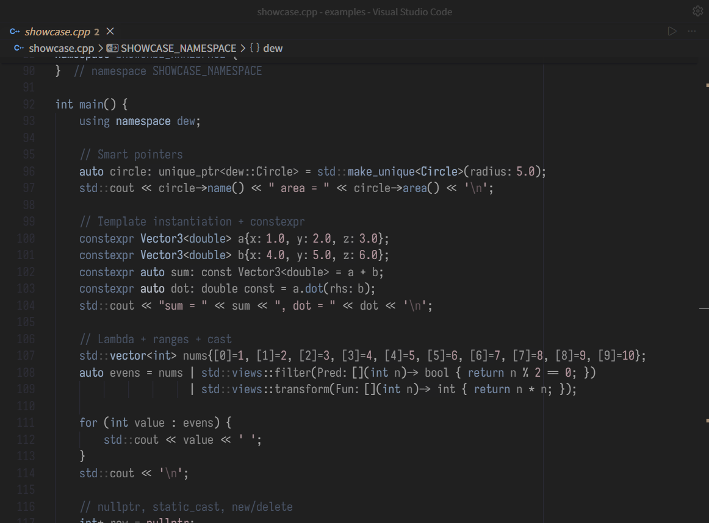
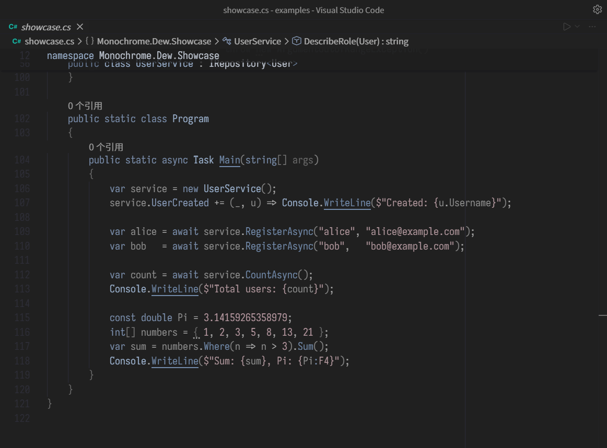
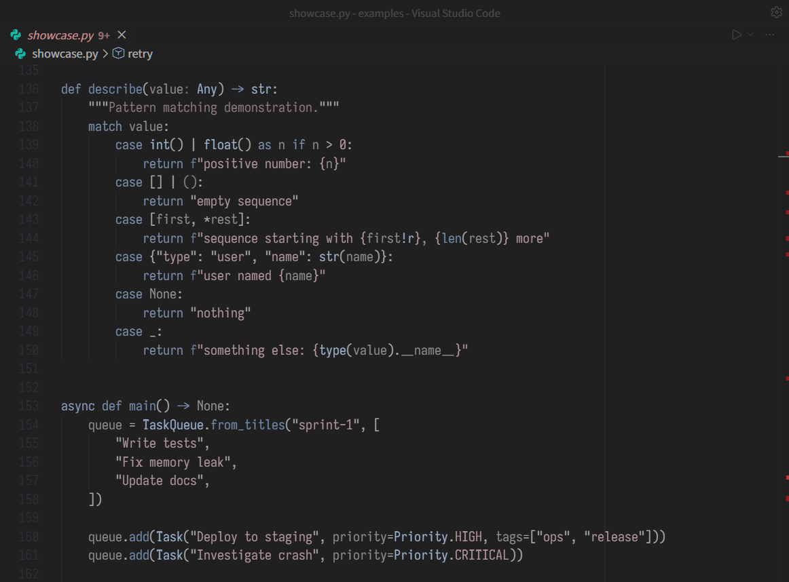
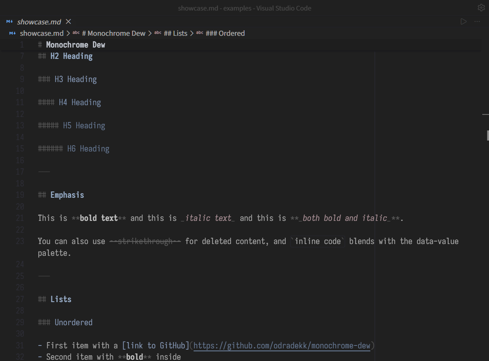
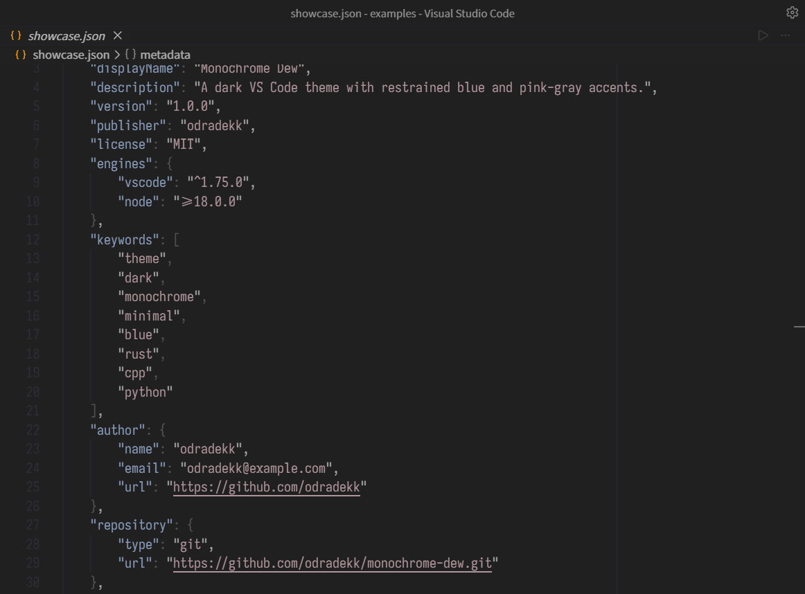
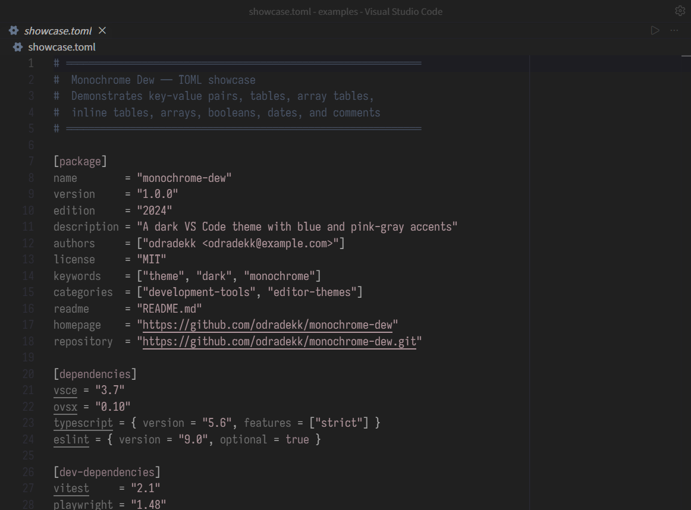
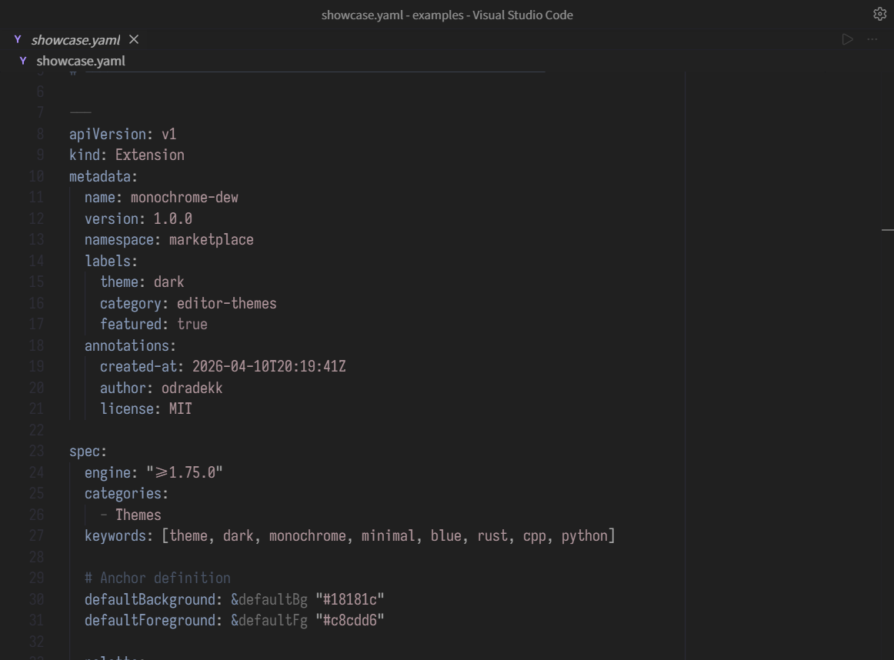
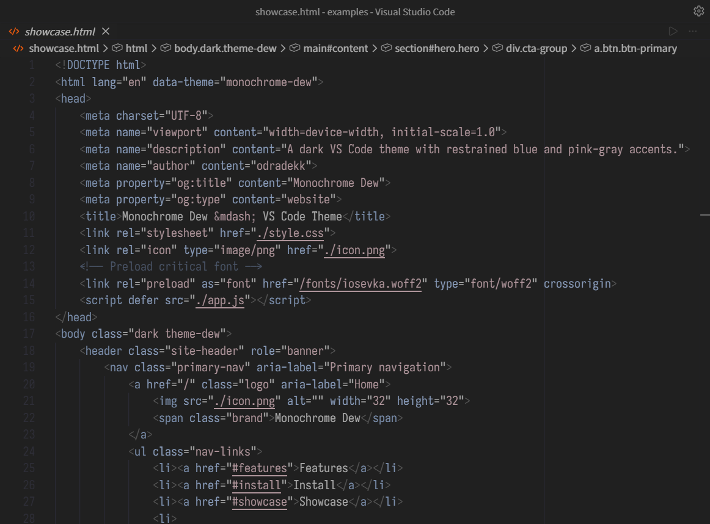
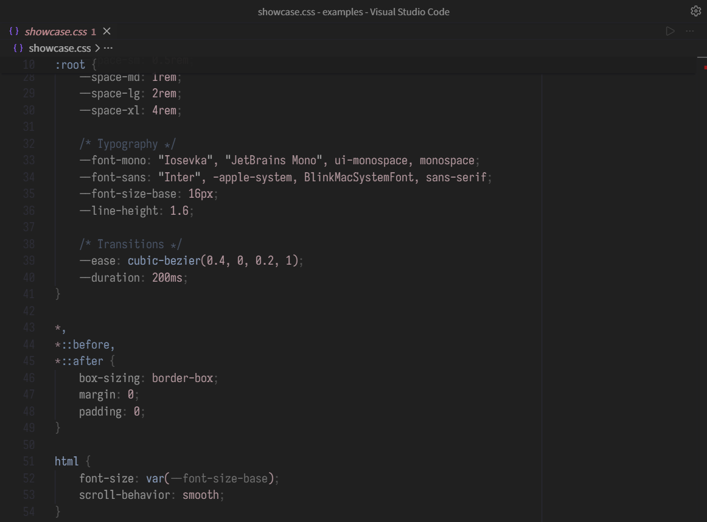

# Monochrome Dew

[](https://github.com/odradekk/monochrome-dew/releases)
[](https://marketplace.visualstudio.com/items?itemName=odradekk.monochrome-dew)
[](https://open-vsx.org/extension/odradekk/monochrome-dew)
[](./LICENSE)
[](https://github.com/odradekk/monochrome-dew/stargazers)

> A dark VS Code theme that extends **Monochrome Dark** with soft blue, pink, and gold accents — like morning dew on a gray stone.

---

## Preview







<details>
<summary>More languages</summary>







</details>

---

## Design

Four color families on a uniform near-black base (`#111113`):

| Role | Color | Used for |
|------|-------|----------|
| **Structure** | blue `#5f7695` → `#bccee6` | keywords, types, functions, modules, lifetimes |
| **Data** | pink `#b67c8f` → `#d49bae` | strings, `self`/`this`, mutable variables |
| **Rare** | gold `#95855f` → `#e6d9bc` | numbers, booleans, enum members, macros, attributes, warnings |
| **Neutral** | gray `#555555` → `#aaaaaa` | variables, operators, punctuation |

Each hue family shares one lightness ramp (faint → dim → main → bright, 28–45% saturation), so all three read at equal visual weight — softly colored, never neon. Errors use an alarm pink (`#db7698`), a higher-saturation member of the data family.

Readable neutral text uses stronger contrast (`#7c7c7c` for ordinary variables and `#5f7695` for comments), while punctuation and markup remain deliberately dim. Control-flow and structural declaration keywords are bold in C#, C++, Rust, and Python. Type, callable, and precisely identified constant names are bold only at their declaration or definition.

---

## Language Support

Fine-grained scope rules and semantic token colors for:

- **C#** — LINQ, attributes, XML doc comments, access modifier tiers
- **C++** — templates, `constexpr` hierarchy, operator overloads, preprocessor
- **Rust** — traits, lifetimes, macros, `unsafe`, mutable variable distinction
- **Python** — decorators, f-strings, docstrings, `self`/`cls`, type hints
- **Markdown** — H1-H6 gold hierarchy, dimmed markers
- **JSON / TOML / YAML** — key vs. value separation
- **HTML / CSS** — tag/attribute/property tiers

---

## Installation

### VS Code Marketplace

Extensions panel → search `Monochrome Dew` → Install.

### Open VSX (Cursor, VSCodium, Gitpod)

```bash
ovsx install odradekk.monochrome-dew
```

### Manual (.vsix)

Download from [Releases](https://github.com/odradekk/monochrome-dew/releases):

```bash
code --install-extension monochrome-dew-1.2.0.vsix
```

---

## Recommended Settings

```jsonc
{
    "editor.fontFamily": "'Iosevka', 'JetBrains Mono', monospace",
    "editor.fontLigatures": true,
    "editor.bracketPairColorization.enabled": false,
    "editor.guides.bracketPairs": false,
    "editor.semanticHighlighting.enabled": true
}
```

---

## Credits

Built on the shoulders of:

- **[Monochrome](https://marketplace.visualstudio.com/items?itemName=anotherglitchinthematrix.monochrome)** — base UI palette and color philosophy
- **[eppz! Code](https://github.com/Geri-Borbas/VSCode.Extension.eppz_Code)** — C# scope matching patterns

Not affiliated with or endorsed by either project.

---

## License

[MIT](./LICENSE) © odradekk
